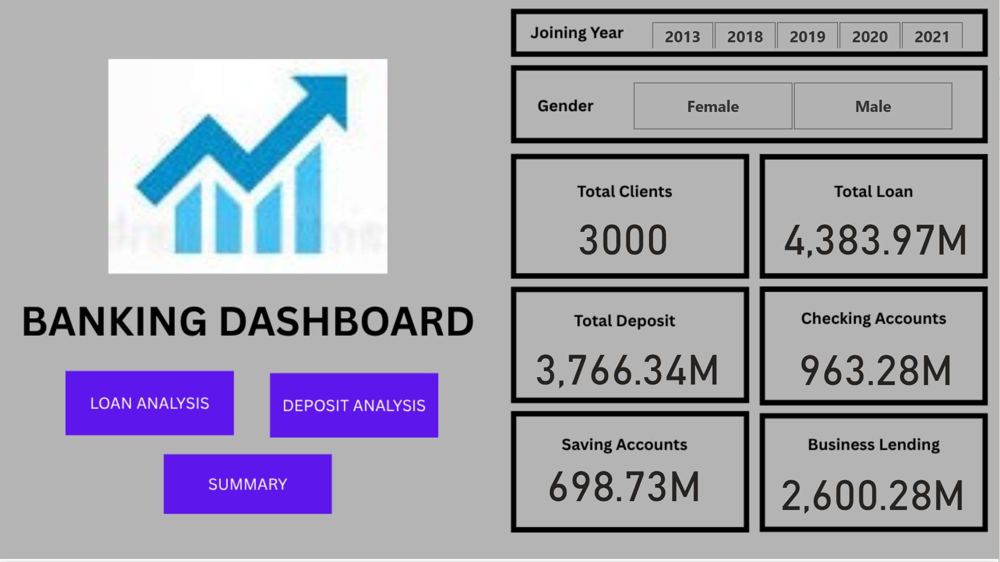

# Banking-Risk-Analysis-Dashboard-Power-BI

## 📌 Project Overview
This Power BI dashboard provides a comprehensive analysis of banking customer data to assess risk levels, product usage, and financial behavior. It is designed to support data-driven decision-making in credit and risk departments.

## 📊 Dashboard Features
- Customer segmentation by risk weight
- Product portfolio breakdown (Loans, Deposits, Credit Cards)
- Age, Gender, and Occupation-based analysis
- Superannuation and Income comparison
- KPI cards for total customers, average income, and high-risk accounts
- Filters for Nationality, Location, Loyalty Classification

## 🧰 Tools & Technologies
- Power BI (Data Visualization)
- Excel / MySQL (Data Cleaning)
- DAX (KPIs and Calculated Columns)
- Power Query

## 📷 Dashboard Preview

## 🔗 Live Report
[Click to View on Power BI](https://app.powerbi.com/groups/me/reports/52a15260-e81d-46de-b2ec-ad24e6cf15b8/c8e5379b3ce7eaa04b05?experience=power-bi)
